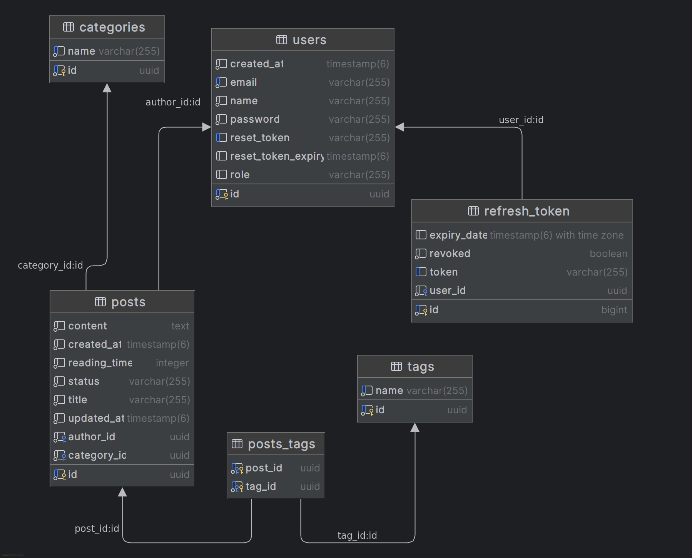

# Minimal Blog

A modern, role-based content management system built with React and Spring Boot. This application provides a streamlined blogging platform with distinct user roles and comprehensive content management capabilities.

## Features

### Role-Based Access Control
- **Admin**: Full system privileges including editor registration, content approval/rejection, and all editor capabilities
- **Editor**: Content creation, tag and category management, post editing and publishing
- **Author**: Personal content management with access to submitted and draft posts

### Content Management
- Rich text editor with TipTap integration
- Draft and publish workflow
- Post categorization with tags and categories
- Content approval system for quality control

### Authentication & Security
- JWT-based authentication with automatic token refresh
- Secure API client with interceptors for token management
- Protected routes based on user roles
- Password reset functionality

### User Interface
- Modern, responsive design with Tailwind CSS
- Dark/light theme support
- Interactive data tables with sorting and filtering
- Toast notifications for user feedback

### Technical Features
- Built with React 19 and Vite for optimal performance
- State management with TanStack Query (React Query)
- Client-side routing with React Router
- Component library with Radix UI primitives


### Database Schema
The application uses PostgreSQL with the following schema:



*The schema includes tables for users, refresh-token, posts, categories, tags, and their relationships, supporting the role-based access control and content management features.*

### Backend Repository

For more information about the backend please visit the specific repo.
- **API Repository**: [Minimal Blog Backend API](https://github.com/2016mehrab/minimal-blog-api)

## Technology Stack

- **Frontend**: React 19, Vite, TypeScript
- **Styling**: Tailwind CSS, Shadcn UI
- **State Management**: TanStack Query
- **Routing**: React Router v7
- **Rich Text Editor**: TipTap
- **HTTP Client**: Axios with automatic token refresh
- **Icons**:  Lucide React

## Getting Started

### Prerequisites
- Node.js (version 18 or higher)
- npm or yarn package manager

### Installation

1. **Clone the repository**
   ```bash
   git clone https://github.com/2016mehrab/minimal-blog.git
   cd minimal-blog
   ```

2. **Install dependencies**
   ```bash
   npm install
   ```

3. **Start the development server**
   ```bash
   npm run dev
   ```

4. **Build for production**
   ```bash
   npm run build
   ```

5. **Preview production build**
   ```bash
   npm run preview
   ```

### Available Scripts

- `npm run dev` - Start development server
- `npm run build` - Build for production
- `npm run preview` - Preview production build
- `npm run lint` - Run ESLint
- `npm run serve` - Serve production build

## Project Structure

```
src/
├── app/
├── components/
│   ├── ui/
│   └── ...
├── hooks/
├── lib/
├── Pages/
│   ├── BlogDetails.jsx
│   ├── Category.jsx
│   ├── Drafts.jsx
│   ├── EditorRegistration.jsx
│   ├── ForgotPassword.jsx
│   ├── Home.jsx
│   ├── Login.jsx
│   ├── MyPendingBlogs.jsx
│   ├── PageNotFound.jsx
│   ├── PendingPosts.jsx
│   ├── Post.jsx
│   ├── Register.jsx
│   ├── ResetPassword.jsx
│   └── Tag.jsx
├── services/
│   ├── apiClient.js
│   ├── auth.js
│   ├── category.js
│   ├── post.js
│   └── tag.js
└── assets/
```

## API Client Features

The application includes a sophisticated API client that:
- Automatically refreshes access tokens using refresh tokens
- Handles token expiration gracefully
- Queues failed requests during token refresh
- Redirects to login on authentication failures
- Supports both public and protected endpoints

## User Roles and Permissions

### Author
- View personal submitted posts
- Access to draft posts
- Basic content viewing capabilities

### Editor
- Same capabilites of `Author`
- Manage categories and tags
- Approve or reject submitted posts


### Admin
- Register new editors
- Full access to all content management features
